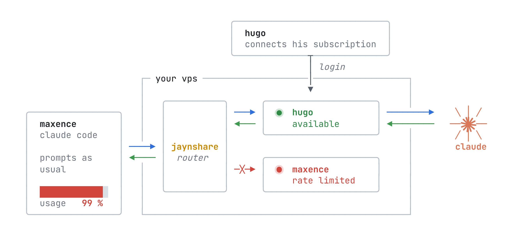

<p align="center">
  <picture>
    <source media="(prefers-color-scheme: dark)"
      srcset="docs/assets/jaynshare-dark.svg">
    
  </picture>
</p>

<p align="center">
  <b>You can share your Claude subscriptions!</b><br>
  <sub>Self-hosted · Linux server · macOS &amp; Windows client</sub>
</p>

<p align="center">
  <a href="https://github.com/jaynlabs/jaynshare/actions/workflows/ci.yml"></a>
  <a href="https://github.com/jaynlabs/jaynshare/releases/latest"></a>
  <a href="LICENSE"></a>
  
</p>

<p align="center">
  <a href="#quick-start">Quick start</a> ·
  <a href="#documentation">Docs</a> ·
  <a href="is_this_safe.md">Is this safe?</a> ·
  <a href="https://jayn.app/jaynshare">Website</a>
</p>

jaynshare is a self-hosted proxy for Claude Code (or third party hosted if you
have trust to spare). After hosting a server, connecting several accounts to it
and enrolling a client, replace `claude` by `jaynshare claude` and you will be
able to choose from which account to draw for your session.

> [!WARNING]
> Pooling Claude subscriptions conflicts with Anthropic's published terms and
> can lead to suspension or termination of every account involved, without a
> refund. Whether a particular deployment also raises legal issues depends on
> its facts and jurisdiction; this project does not claim that it is legal or
> authorized. Read the [subscription-sharing risk summary](is_this_safe.md), the
> [security and privacy model](docs/security-and-privacy.md), and the
> [operator obligations](deploy/README-server.md) before deploying.

## How it works

<p align="center">
  <picture>
    <source media="(prefers-color-scheme: dark)"
      srcset="docs/assets/overview-dark.png">
    
  </picture>
</p>

## Try it on your Mac

Before having to set up a server, you can spin up one on your own Mac easily
using this (it downloads the latest release, runs it, joins a client and
prompts you to log your Claude account).

It needs `python3` and Claude Code installed.

```sh
curl -fsSLO https://github.com/jaynlabs/jaynshare/releases/latest/download/quickstart.sh
bash quickstart.sh          #sets up everything
bash quickstart.sh claude   #launches claude
```

## Demo

<p align="center">
  
</p>

This demo was v1. Pretty much still the same but v2 is now in Rust and CC config
changes are less invasive.

## Purpose and disclaimers

This is a project by Jayn Labs started by my friend and I cause we were sick of
getting rate limited while the other had plenty leftover quota.

PLEASE, yes this was GREATLY done with AI. No matter your opinion on the matter,
feel free to give us feedback. Reworking everything from the ground up is not
something frightening us. So truly feel free to give any feedback (even to roast
us), as long as it helps us improve.

Oh, and yes, we've seen Team Claude on github. We were inspired by their
project. To be fair, our v1 was mostly a fork of their code, that's why we've
done v2 in Rust to make this codebase our own and not just a fancy fork.

This was not made by, endorsed by, or affiliated with Anthropic; Claude Code is
a product of Anthropic.

> [!IMPORTANT]
> jaynshare is a "trusted" intermediary, not an E2E encrypted relay. The
> server receives EVERYTHING in plaintext so it can route and retry them.
> A server operator—or anyone who compromises the server—can read or alter
> that traffic. Only use a server whose operator and deployed code you trust.

## Highlights

- OAuth subscription and API-key accounts
- An account picker at launch and a Claude Code status line naming the serving
  account
- A one-line join for macOS and Windows from a single-use invite, with a secret
  per client, rotation and revocation
- Claude accounts added by their owners while joining
- Private-network listeners only, TLS pinned to the server's own identity, and
  an audit log that never holds a body or a credential
- Signed releases, a one-command systemd install, optional nightly updates,
  and clients that follow their server's version
- One Rust binary for the server and the client

## Requirements for self hosting

- A Linux server with systemd
- A private network between the engineers and the server, such as a tailnet
  (but I'm sure you can make it work with other clever solutions)
- Claude Code already installed on each engineer's machine

## Quick start

### Server

On the server, as a user with sudo:

```sh
curl -fsSL https://github.com/jaynlabs/jaynshare/releases/latest/download/install.sh | sudo sh
```

It installs the newest release as a systemd service on the host's Tailscale
address (or its only private address; otherwise it asks), and ends with an
invite for you: `jaynshare join jsi1_…`. Run it again to update. From a clone,
`tools/install-server.sh` does the same with your own build.

Operator commands run on the server as its service account:

```sh
alias js='sudo -u jaynshare -H jaynshare'
js client invite bob                   # → jaynshare join jsi1_…
js status
sudo jaynshare server auto-update on   # update every night; clients follow
```

An invite works once and expires after a day. Send it through a private
channel.

The [server installation notes](deploy/README-server.md) cover the operator
trust boundary, the decision record every pooled account needs, and the
private-network rules jaynshare cannot enforce for you.

### Engineer

With the invite from your operator, on macOS:

```sh
curl -fsSL https://github.com/jaynlabs/jaynshare/releases/latest/download/install.sh | sh -s -- join jsi1_…
```

On Windows, in PowerShell:

```powershell
& ([scriptblock]::Create((irm https://github.com/jaynlabs/jaynshare/releases/latest/download/install.ps1))) jsi1_…
```

The join checks that the server is the one the invite names, installs that
server's client and offers to add your Claude account to the pool. Then run
`jaynshare claude` wherever you would have run `claude`. The client updates
itself whenever the server does.

`jaynshare claude` opens a picker when the pool cannot choose for you;
`--account <name>` names the account, `--auto` lets the pool pick, and
`--direct` runs Claude Code outside the pool under your own login. Arguments
after `--` go to Claude Code unchanged. `jaynshare status` checks enrollment
and connectivity, `jaynshare account login` adds your account later, and
`jaynshare alias` prints a shell alias so that `claude` itself goes through the
pool.

## Roadmap / Ideas

- [x] Rust v2
- [ ] `jaynshare codex`
- [ ] API-key subscriptions from other providers, like OpenCode Go
- [ ] Account features (settings, plugins, skills, MCP servers) when you draw
      from your own account (the pool refuses them for everyone today)
- [ ] Owner limits: cap what the pool draws from you, and pause it yourself
- [ ] Draw credits: what you can draw from others' accounts follows what you
      give the pool
- [ ] Linux client installer

## Documentation

- [Is subscription sharing safe?](is_this_safe.md)
- [Security and privacy model](docs/security-and-privacy.md)
- [Server installation and operator obligations](deploy/README-server.md)
- [Release tooling](tools/release/README.md)
- `jaynshare help` and `jaynshare help <verb>`: every verb, its options, exit
  codes and examples

## Development

Rust 1.95 (`rust-toolchain.toml` pins it). Nothing in the build or the tests
needs credentials or network access to Anthropic.

```sh
cargo build --release
cargo test --bins                      # unit tests
JAYNSHARE_BIN=target/release/jaynshare cargo test --test acceptance -- --test-threads=8
cargo clippy --all-targets -- -D warnings
cargo fmt --all -- --check
```

CI runs the above; see `.github/workflows/ci.yml`. The acceptance tests that
need Linux run in Docker and are skipped where no Docker daemon answers.
CI caches Cargo's registry and build directories, including incremental
compiler data but excluding acceptance outputs. Its optimized test binaries
disable LTO; published releases keep the release profile in `Cargo.toml`.
CI builds the Linux musl binary through this cache and sets
`JAYNSHARE_LINUX_BIN` to reuse it in Docker. Locally, set that variable to an
existing musl build to avoid the container build. A focused
`cargo test --test acceptance <scenario>` uses the debug binary without
needing a release build.

Where things live:

- `src/` — the server, the client and the CLI
- `deploy/` — the server notes, the release key (`release-key.pub`) and the
  client kit's README (`kit/`)
- `tools/release/` — packaging, signing, publishing and the `install.sh` /
  `install.ps1` bootstraps

Issues and pull requests are welcome; open an issue before a large change.
Report security issues privately as described in [SECURITY.md](SECURITY.md).

## License

MIT, © Jayn Labs. See [LICENSE](LICENSE), and [NOTICE.md](NOTICE.md) for the
Rust crates Jaynshare links.
