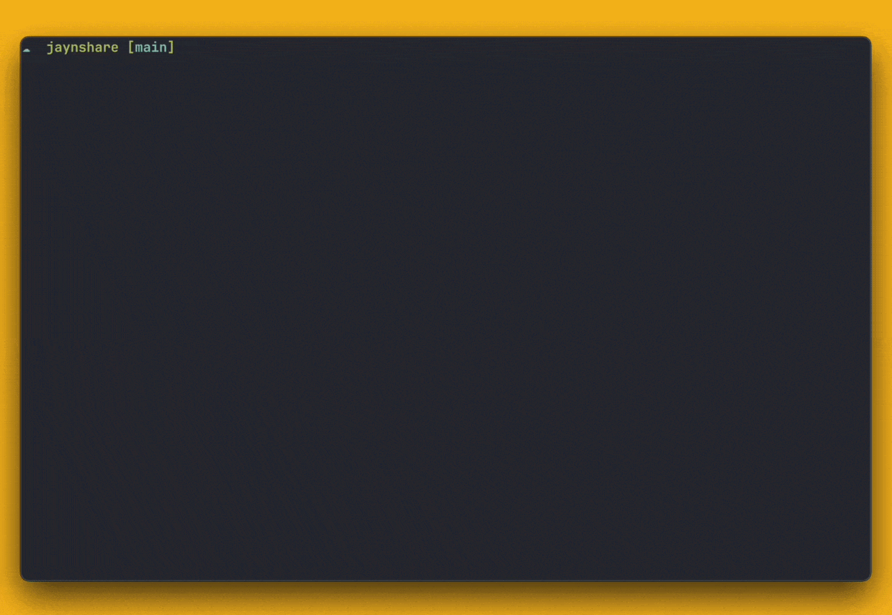

<p align="center">
  <picture>
    <source media="(prefers-color-scheme: dark)"
      srcset="docs/assets/jaynshare-dark.svg">
    
  </picture>
</p>

<p align="center">
  <b>You can share your Claude and Codex subscriptions!</b><br>
  <sub>Self-hosted · Linux server · macOS &amp; Windows client</sub>
</p>

<p align="center">
  <a href="https://github.com/jaynlabs/jaynshare/actions/workflows/ci.yml"></a>
  <a href="https://github.com/jaynlabs/jaynshare/releases/latest"></a>
  <a href="LICENSE"></a>
  
</p>

<p align="center">
  <a href="#quick-start">Quick start</a> ·
  <a href="#documentation">Docs</a> ·
  <a href="is_this_safe.md">Is this safe?</a> ·
  <a href="https://jayn.app/jaynshare">Website</a>
</p>

jaynshare is a self-hosted proxy for Claude Code and Codex.
Just replace `claude` by `jaynshare claude` (or `codex` by `jaynshare codex`)
and you can draw from your friends' subscriptions when yours is rate limited.
PS : It also works if you pool several accounts of your own.

> [!WARNING]
> Pooling Claude subscriptions conflicts with Anthropic's terms and
> can lead to suspension or termination of every account involved.
> Same for OpenAI. Whether a particular deployment also raises legal issues depends on
> its facts and jurisdiction; this project does not claim that it is legal or
> authorized. Read the [subscription-sharing risk summary](is_this_safe.md), the
> [security and privacy model](docs/security-and-privacy.md), and the
> [operator obligations](deploy/README-server.md) before deploying.

## How it works

<p align="center">
  <picture>
    <source media="(prefers-color-scheme: dark)"
      srcset="docs/assets/overview-dark.png">
    
  </picture>
</p>

## Try it on your Mac

Before having to set up a server, you can spin up one on your own Mac easily
using this (it downloads the latest release, runs it, joins a client and
offers to add your accounts).

It needs `python3`, and Claude Code or Codex installed.

```sh
curl -fsSLO https://github.com/jaynlabs/jaynshare/releases/latest/download/quickstart.sh
bash quickstart.sh          #sets up everything
bash quickstart.sh claude   #launches claude
bash quickstart.sh codex    #launches codex
```

## Demo

<p align="center">
  
</p>

## Purpose and disclaimers

This is a project by Jayn Labs started by my friend and I cause we were sick of
getting rate limited while the other had plenty leftover quota.

PLEASE, yes this was GREATLY done with AI. Reworking everything from the ground up is not
something frightening us. So truly feel free to give any feedback (even to roast
us), as long as it helps us improve.

Shout out to TeamClaude on github. We were more than inspired by their
work cause our v1 was mostly a fork.

This was not made by, endorsed by, or affiliated with Anthropic; Claude Code is
a product of Anthropic.

## Highlights

- OAuth subscription and API-key accounts
- Account picker at launch
- Claude Code status line naming the serving account
- One-line join for macOS and Windows from a single-use invite
- Anthropic and OpenAI accounts added by their owners when joining
- Private-network listeners only, TLS pinned to the server's own identity, and
  an audit log that never holds a body or a credential
- Signed releases, a one-command systemd install, optional nightly updates,
  and clients that follow their server's version
- One Rust binary for the server and the client

## Requirements for self hosting

- A Linux server with systemd
- A private network between the engineers and the server, such as a tailnet
  (but I'm sure you can make it work with other clever solutions)
- Claude Code or Codex already installed on each engineer's machine

## Quick start

### Server

On the server, as a user with sudo:

```sh
curl -fsSL https://github.com/jaynlabs/jaynshare/releases/latest/download/install.sh | sudo sh
```

It installs the newest release as a systemd service on the host's Tailscale
address (or its only private address; otherwise it asks), and ends with an
invite for you: `jaynshare join jsi1_…`. Run it again to update. From a clone,
`tools/install-server.sh` does the same with your own build.

Operator commands run on the server as its service account:

```sh
alias js='sudo -u jaynshare -H jaynshare'
js client invite bob                   # → jaynshare join jsi1_…
js status
sudo jaynshare server auto-update on   # update every night; clients follow
```

An invite works once and expires after a day. Send it through a private
channel.

The [server installation notes](deploy/README-server.md) cover the operator
trust boundary, the decision record every pooled account needs, and the
private-network rules jaynshare cannot enforce for you.

### Engineer

With the invite from your operator, on macOS:

```sh
curl -fsSL https://github.com/jaynlabs/jaynshare/releases/latest/download/install.sh | sh -s -- join jsi1_…
```

On Windows, in PowerShell:

```powershell
& ([scriptblock]::Create((irm https://github.com/jaynlabs/jaynshare/releases/latest/download/install.ps1))) jsi1_…
```

The join checks that the server is the one the invite names, installs that
server's client and offers to add each of your accounts to the pool, Claude
and ChatGPT alike. Then run `jaynshare claude` wherever you would have run
`claude`, and `jaynshare codex` wherever you would have run `codex`. The client
updates itself whenever the server does.

`jaynshare claude` and `jaynshare codex` open a picker when the pool cannot
choose for you; `--account <name>` names the account, `--auto` lets the pool
pick, and `--direct` runs the tool outside the pool under your own login.
`jaynshare` alone opens one picker over every pooled account, grouped by tool
with each account's five-hour and weekly usage, and launches the tool of the
account you pick.
Arguments after `--` go to the tool unchanged. `jaynshare status` checks enrollment
and connectivity and shows every pooled account's five-hour and weekly usage
in a colored table; `--verbose` adds the other status details. A cyan `┃`
marks the elapsed share of the reset period when the reset time is known.
`jaynshare account login` adds your account later, and `jaynshare alias` prints
a shell alias so that `claude` itself goes through the pool.

`jaynshare codex` does the same for Codex over the pool's ChatGPT accounts,
added with `jaynshare account login --provider codex`. Codex still needs your
own `codex login`; the pool replaces it on every request.

### Claude Desktop Chat on macOS

On an enrolled Mac, install Claude Desktop in `/Applications` or
`~/Applications`, open it once to finish installing its managed Claude Code
runtime, then quit the app fully. Start the connection from a terminal:

```sh
jaynshare desktop                       # Anthropic account picker
jaynshare desktop --account <reference> # pin new sessions to that account
jaynshare desktop --auto                # automatic selection
```

This command opens Desktop after its authenticated loopback Gateway is ready.
Keep the command running: Ctrl-C or closing its terminal stops the connection.
A second command with the same account and enrollment reuses the active adapter.
Stop the original command and quit Desktop fully before changing accounts.
Existing sessions keep their server-side account binding; an exhausted bound
account returns an error instead of switching accounts mid-conversation.

The integration checks Desktop **2.26454.0 with Claude Code 2.1.289**, and
**2.26454.2 or 2.31226.0 with Claude Code 2.1.293**. The 2.31226.0 profile and
startup/title contracts were verified from its installed bundle with mocked
transport; a live Chat test completed on 2.31226.0. Other versions, missing
or ambiguous managed runtimes, and managed device policies produce a clear
error before profile setup. An app or runtime replacement stops the adapter; quit Desktop
fully and relaunch the command to check compatibility again.

The integration selects a named **Jaynshare** Gateway in Desktop's separate
`Claude-3p` profile. Desktop receives a fresh local bearer, while the Rust client
uses your enrollment and server identity pin internally. No system CA or Node
relay is installed. Only **Chat with Sonnet 4.6** is in scope. Text and explicitly
permitted local-file access were exercised in the compatibility experiment;
uploaded images, PDFs and text attachments, Cowork, Code, Chrome, connectors,
projects, memory and artifacts have not passed the native app release gates.
The managed engine's token-count requests use the same enrolled pool transport
as inference; Desktop can issue many independent counts for its context breakdown.
Model discovery is unsupported because the model is configured explicitly.
Connection warming is answered locally. The [gateway compatibility guide](https://code.claude.com/docs/en/llm-gateway-protocol)
describes the engine's optional endpoint behavior.
Request logs identify the operation: relayed token counts use `count_tokens`.
Direct token counts outside the managed engine, `title_fallback` and `models`
return local `501`s with `x-should-retry: false` to avoid SDK retries.
A successful relayed request logs `operation=inference`
with status `200`; `unsupported_direct` identifies a request needing a compatibility
update. These labels contain no prompts, session identifiers or credentials.

Desktop and its child engine can still make other outbound connections. A strict
guarantee that all inference uses Jaynshare requires a traffic audit and an OS
egress policy covering both processes. Updates, downloads and tool traffic also
need an explicit policy; the local Gateway alone does not enforce one.

Quit Desktop and stop the adapter before removing the integration:

```sh
jaynshare desktop --restore
```

Restore and client uninstall remove the local credential and Jaynshare entry,
restore owned selection fields only while they still match the installed
values, and preserve other Gateways, preferences and conversation history.
An interrupted setup can be retried or restored. A port collision leaves the
recorded origin in place; stop the competing process, or restore while Desktop
is closed before setting up again. Unknown direct auxiliary requests fail
locally; changed probe/title formats need a compatibility update.

Live attachment/tool/permission checks, current-app startup/title/chat timings
and comparison with normal Desktop remain release gates. The server rollout
must also include the independent incomplete-TLS-handshake fix.

## Roadmap / Ideas

- [x] Rust v2
- [x] `jaynshare codex`
- [ ] OpenAI API-key accounts for `jaynshare codex`
- [ ] API-key subscriptions from other providers, like OpenCode Go
- [ ] Account features (settings, plugins, skills, MCP servers) when you draw
      from your own account (the pool refuses them for everyone today)
- [ ] Owner limits: cap what the pool draws from you, and pause it yourself
- [ ] Draw credits: what you can draw from others' accounts follows what you
      give the pool
- [ ] Linux client installer

## Documentation

- [Is subscription sharing safe?](is_this_safe.md)
- [Security and privacy model](docs/security-and-privacy.md)
- [Server installation and operator obligations](deploy/README-server.md)
- [Release tooling](tools/release/README.md)
- `jaynshare help` and `jaynshare help <verb>`: every verb, its options, exit
  codes and examples

## Development

Rust 1.95 (`rust-toolchain.toml` pins it). Nothing in the build or the tests
needs credentials or network access to Anthropic.

```sh
cargo build --release
cargo test --bins                      # unit tests
JAYNSHARE_BIN=target/release/jaynshare cargo test --test acceptance -- --test-threads=8
cargo clippy --all-targets -- -D warnings
cargo fmt --all -- --check
```

CI runs the above; see `.github/workflows/ci.yml`. The acceptance tests that
need Linux run in Docker and are skipped where no Docker daemon answers.
CI caches Cargo's registry and build directories, including incremental
compiler data but excluding acceptance outputs. Its optimized test binaries
disable LTO; published releases keep the release profile in `Cargo.toml`.
CI builds the Linux musl binary through this cache and sets
`JAYNSHARE_LINUX_BIN` to reuse it in Docker. Locally, set that variable to an
existing musl build to avoid the container build. A focused
`cargo test --test acceptance <scenario>` uses the debug binary without
needing a release build.

Where things live:

- `src/` — the server, the client and the CLI
- `deploy/` — the server notes, the release key (`release-key.pub`) and the
  client kit's README (`kit/`)
- `tools/release/` — packaging, signing, publishing and the `install.sh` /
  `install.ps1` bootstraps

Issues and pull requests are welcome; open an issue before a large change.
Report security issues privately as described in [SECURITY.md](SECURITY.md).

## License

MIT, © Jayn Labs. See [LICENSE](LICENSE), and [NOTICE.md](NOTICE.md) for the
Rust crates Jaynshare links.
